# Tripify Flutter Version

## Workspace

Github:

- Repository: https://github.com/stefaniasilivestru/MobileAppDevelopmentProject2
- Releases: https://github.com/stefaniasilivestru/MobileAppDevelopmentProject2/releases

Workspace: https://upm365.sharepoint.com/sites/MobileDevelopmentAlexeSilivestru/SitePages/Week-7.aspx .

## Description

Tripify is the perfect app for creating, managing, and exploring unique routes tailored to your interests. Whether you're a movie buff, a nature enthusiast, or simply seeking new adventures, Tripify empowers you to curate personalized journeys with ease.

With Tripify, you can effortlessly save, edit, and delete routes based on specific criteria, ensuring each excursion aligns perfectly with your preferences. Say goodbye to generic itineraries and hello to tailor-made experiences that cater to your passions. From strolling through the streets of classic films to reliving scenes from beloved TV shows, Tripify transforms ordinary outings into cinematic adventures.

Moreover, with Tripify you can check the weather forecast for your chosen route to ensure optimal conditions, and visualize your path on an interactive map for seamless navigation.

Tripify also fosters social connectivity by enabling authentication, route sharing with friends, and multilingual support for users (EN/ES for the moment). Additionally, the app values user feedback, offering a convenient avenue to share suggestions and enhancements via email or to post user opinions to see all the reviews that app has so far.

In comparison to existing apps on the market, Tripify stands out for its specialized focus on movie and series filming locations, offering a unique niche that caters to entertainment enthusiasts.

## Screenshots and navigation

Include screenshots of the app in action. You can upload the images to GitHub and then reference them here using Markdown or HTML syntax:

<table>
  <tr>
    <td>
      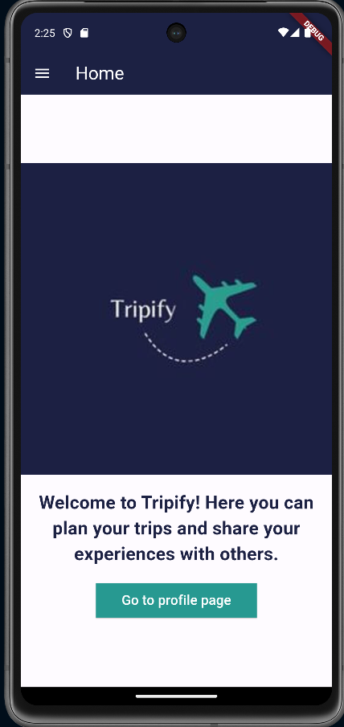
      
Home Screen

    </td>
    <td>
      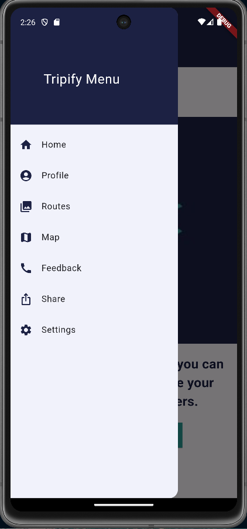
      
Menu of the app

    </td>
    <td>
      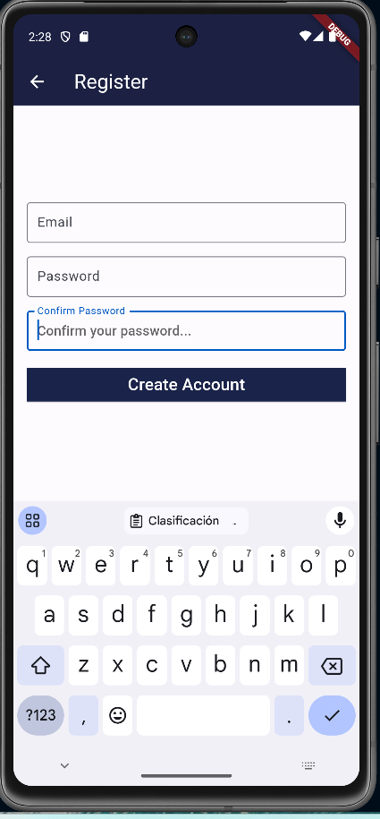
      
Register page

    </td>
  </tr>
  <tr>
    <td>
      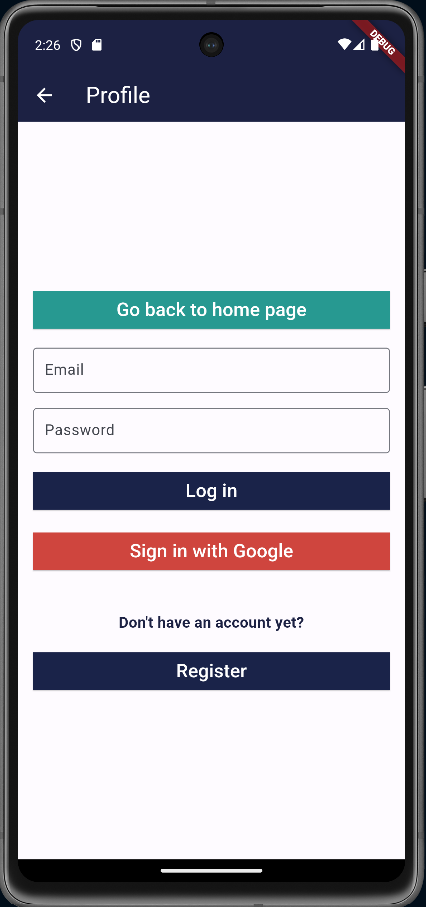
      
Profile Screen - Login

    </td>
    <td>
      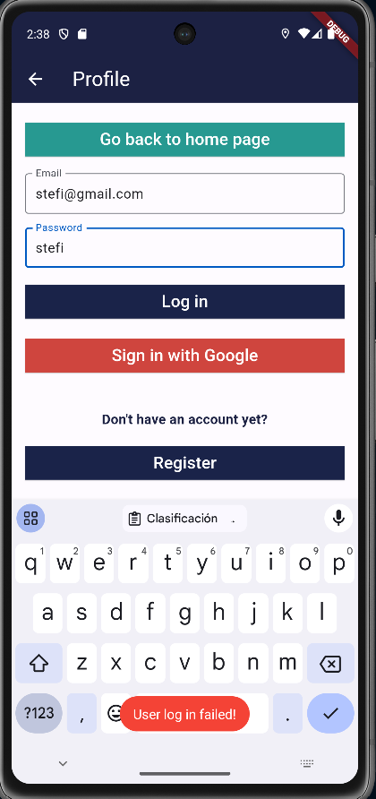
      
Login failed + Toast

    </td>
    <td>
      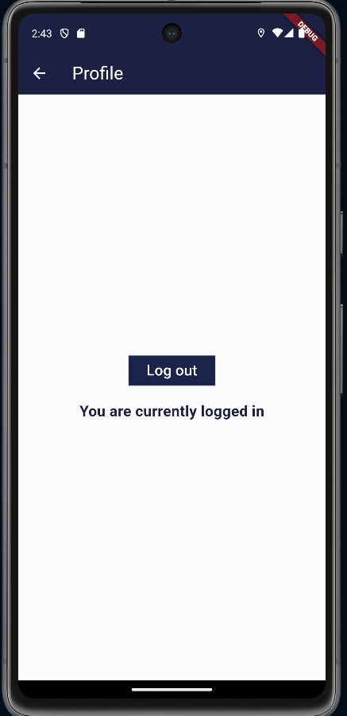
      
User is logged in

    </td>
  </tr>
  <tr>
    <td>
      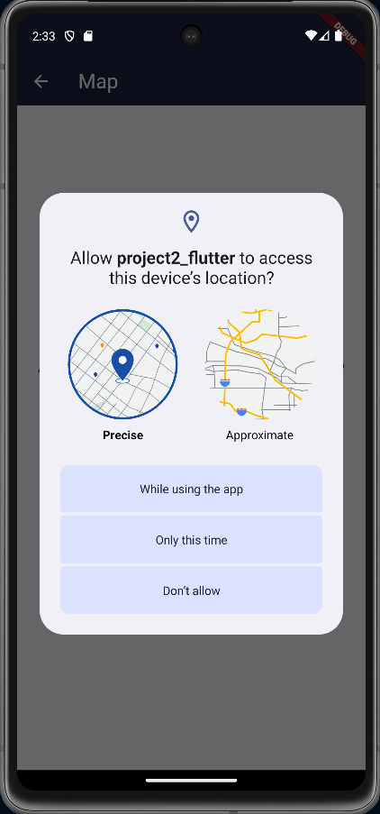
      
Activate location on your device

    </td>
    <td>
      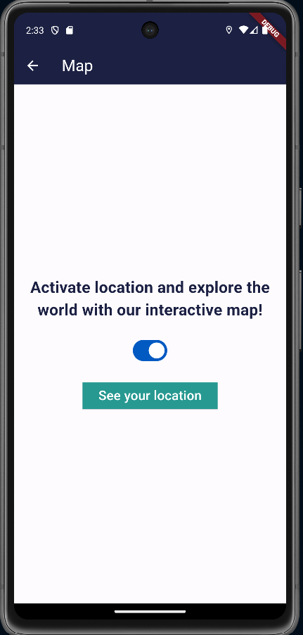
      
Map Screen

    </td>
    <td>
      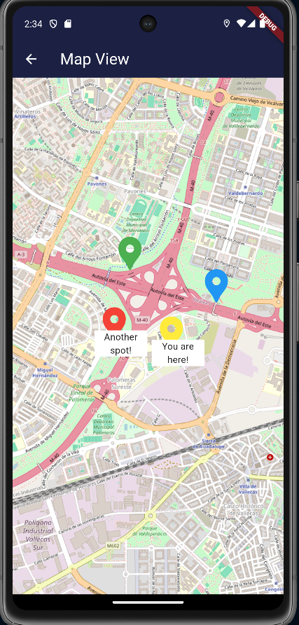
      
Map View - local database

    </td>
  </tr>
  <tr>
    <td>
      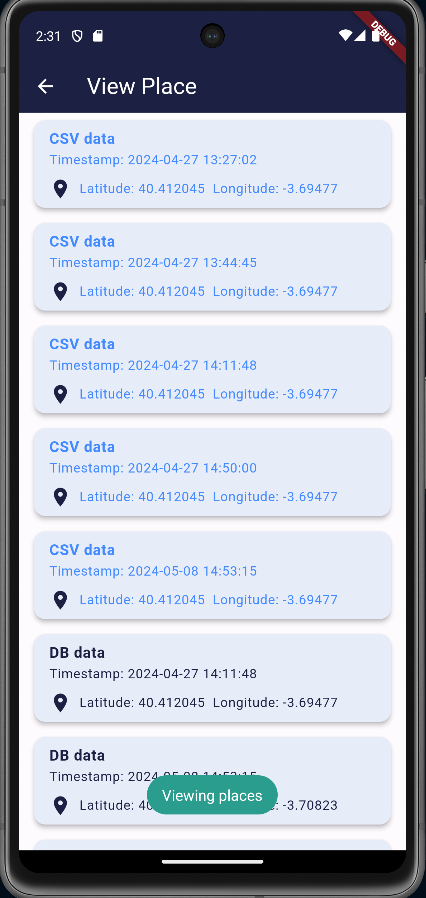
      
Places - Local Database

    </td>
    <td>
      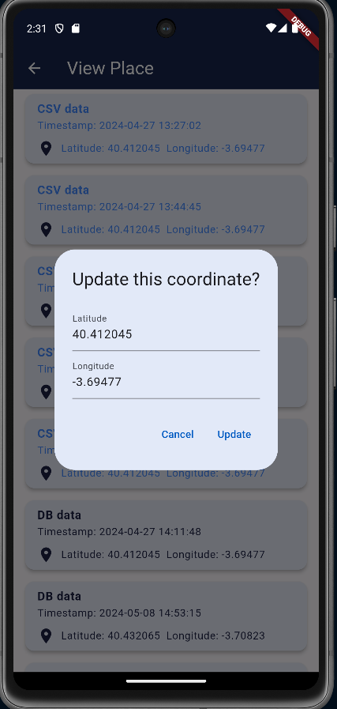
      
Places - Update

    </td>
    <td>
      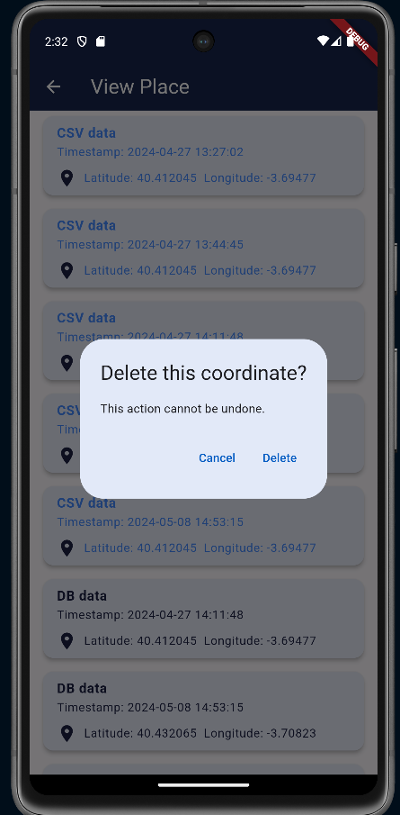
      
Places - Delete

    </td>
  </tr>
  <tr>
    <td>
      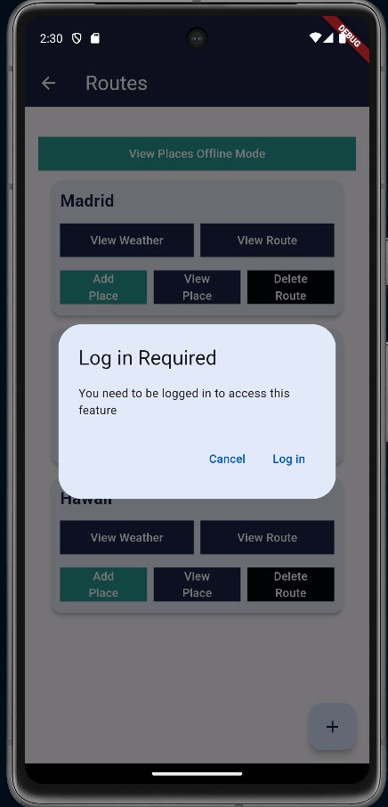
      
Error - User need to be logged to perfom actions

    </td>
    <td>
      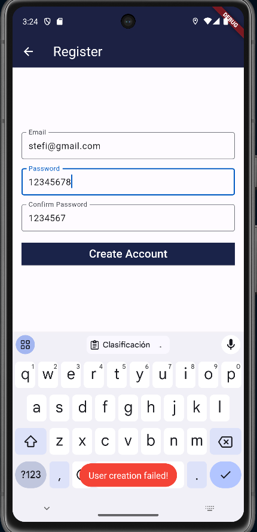
      
Error - Passwords don't match

    </td>
  </tr>
  <tr>
    <td>
      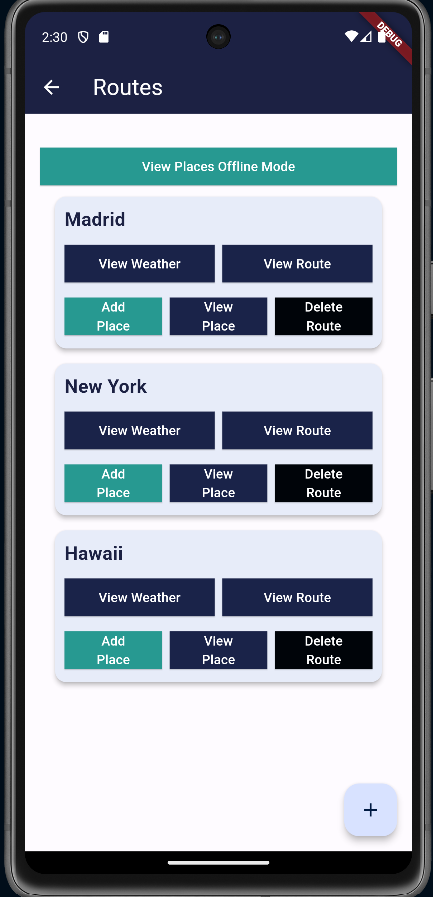
      
Routes - Using Firebase

    </td>
    <td>
      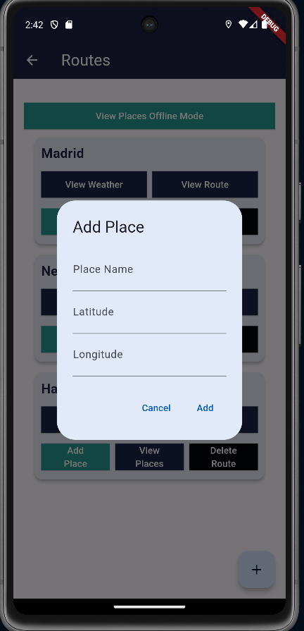
      
Add place

    </td>
    <td>
      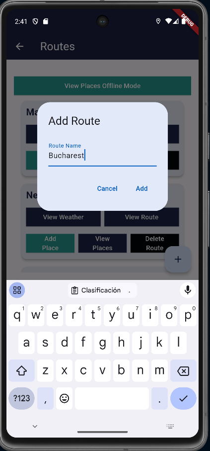
      
Add route

    </td>
  </tr>
  <tr>
    <td>
      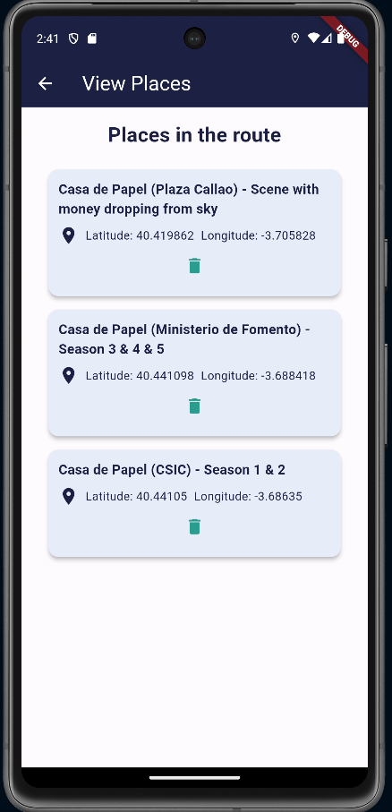
      
View Places - Firebase

    </td>
    <td>
      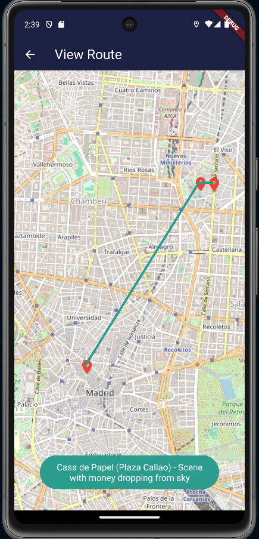
      
View route on map

    </td>
    <td>
      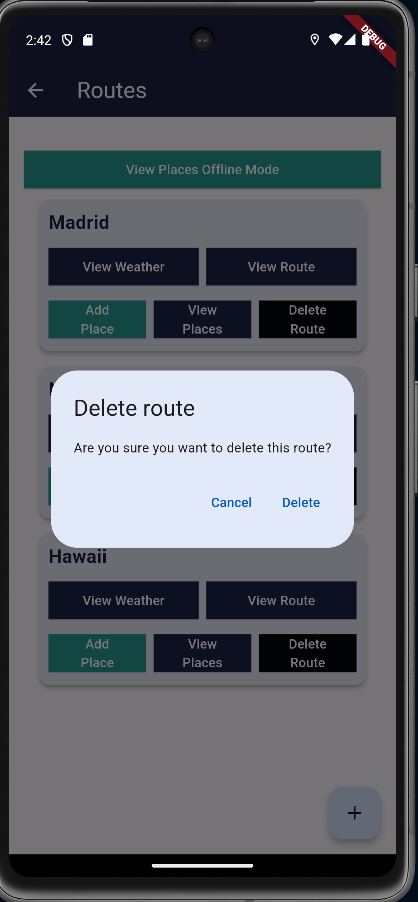
      
Delete route

    </td>
  </tr>
  <tr>
    <td>
      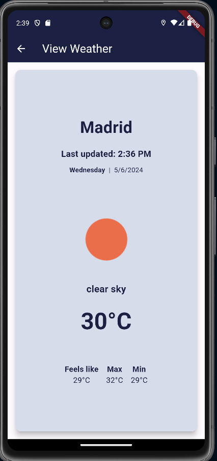
      
See weather

    </td>
    <td>
      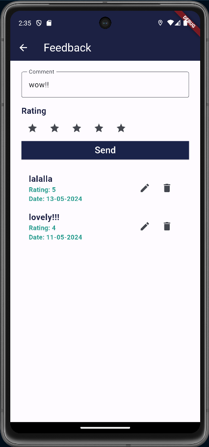
      
Feedback Screen

    </td>
    <td>
      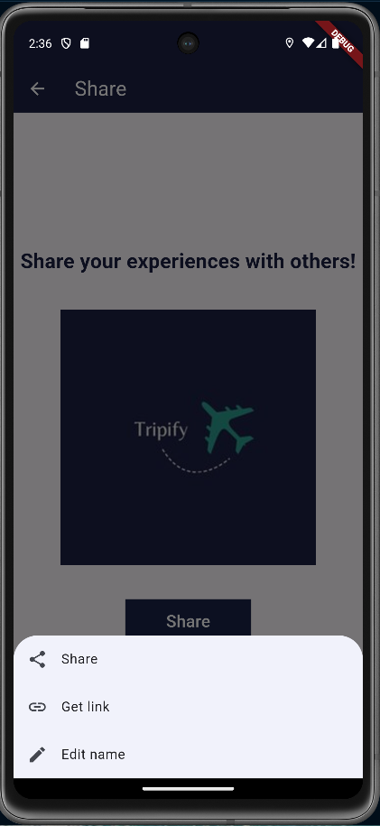
      
Share Screen

    </td>
  </tr>
  <tr>
    <td>
      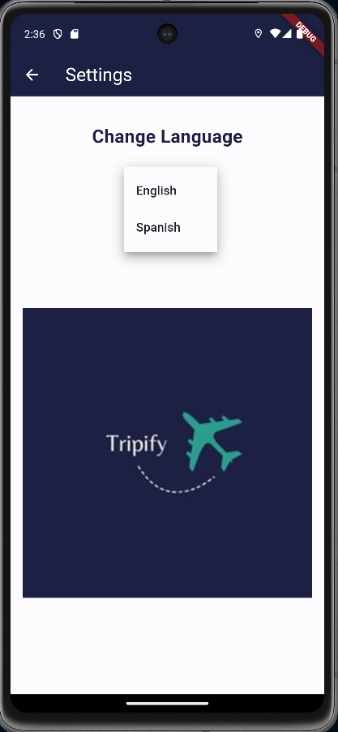
      
Settings Screen

    </td>
    <td>
      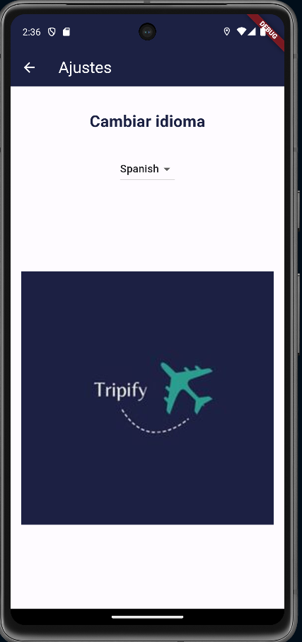
      
Settings Screen ES

    </td>
  </tr>
  <tr>
    <td>
      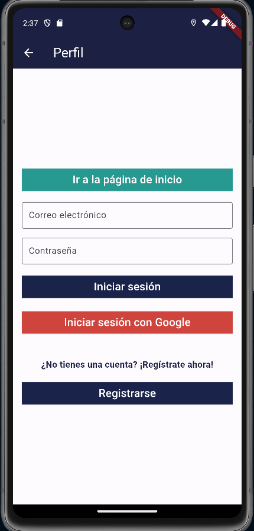
      
Profile page in Spanish

    </td>
    <td>
      
      
Profile page in English

    </td>
  </tr>
</table>

## Demo Video

Video demonstrating how the app works: https://shorturl.at/XQ1D5

## Features

List the **functional** features of the app.

- Add routes and places using a specific criteria (e.g in our demo: routes in cities where famous movies and series were filmed)
- Display route on map
- Change language app
- List your places offline and online
- Delete and edit route
- See weather for a specific route
- Add/Edit/Deelete feedback based on your experience on app

List the **technical** features of the app.

- Persistence in csv/text file -> Coordinates + Timestamp of places
- Persistence in Shared Preferences (routeName and routeId)
- Persistence in local database - SQFLite
- Display Data in UI using ListView
- Widgets lifecycles
- Use of Logging for debug
- Pop-up messages: Alerts, Toasts, Dialogues, Snackbars
- Firebase Realtime database : on routes and feedbacks
- Firebase Authentication
- Maps: OpenStreetMaps - geolocating coordinates using it
- Restful APIs used: (_Openwheathermaps https://openweathermap.org/api .Retrieve weather information data based on specific location_).
- Menu: Navigation Drawer Menu
- Internationalizing App (EN/ES language available: Flutter_localizations package
- Splash Screen
- Replace icon using flutter_launcher_icons

## How to Use

How to get started with the app as user:
- Create an account using Email & Password or Sign up by Gmail
- Log in into your account
- Add a route by typing the city where the route will be located
- Choose your niche route (eg: route where famous movies were filmed)
- Add places
- Choose what actions to perform: see weather details, see route on map, delete your route
- If needed, change your app language
- If needed, share your feedback on Gmail to the creators of the app or with other users posting reviews
- If needed, tell your friends about your routes

## Additional section

The routes.txt file has some tests to check the functionality of the app.

## Participants

List of MAD developers:

- Name: Silivestru Stefania (stefania.silivestru@alumunos.upm.es)
- Name: Alexe Mihai-Victor(mihai-victor.alexe@alumunos.upm.es)
